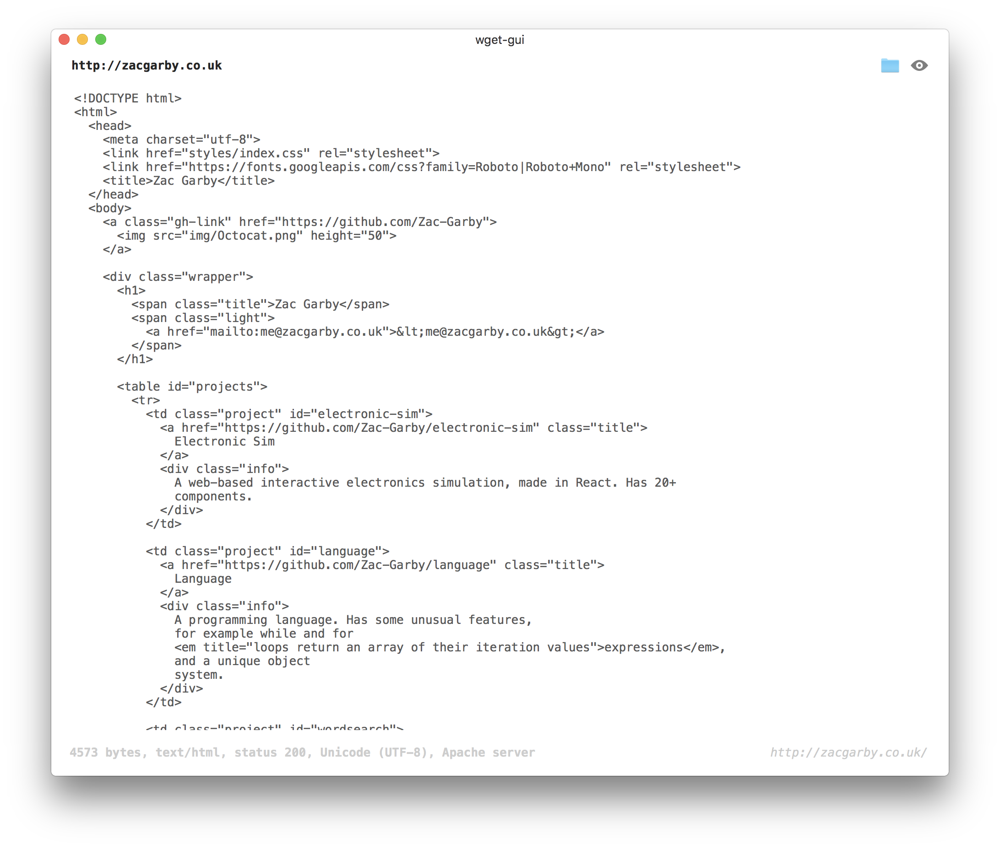

# wget-gui

A cocoa app, written in Swift, which is almost like a GUI wrapper around wget.

You can either save the returned data to a file, or just view it in the app.

## Usage

There aren't any builds on GitHub at the moment, so you have to build it yourself.
It's not too hard though - just open `wget-gui.xcodeproj` in Xcode and build it.
